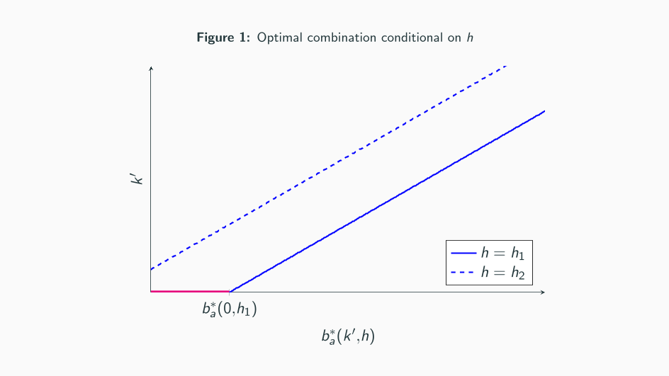
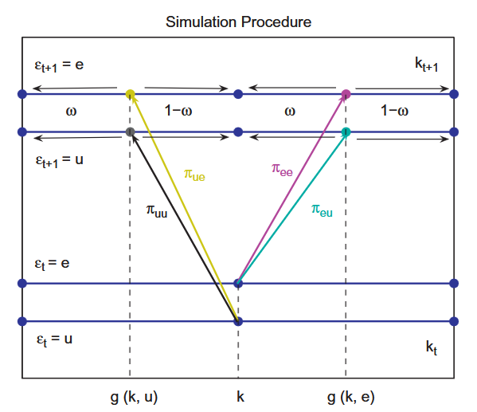

# Computational Notes

This document provides detailed explanations of the computations executed in the code. The topics covered include:

- The [Endogenous Grid Point Method](#algorithm-of-the-endogenous-grid-method) for solving the household problem.
- Aggregation of the household side using [non-stochastic simulations](#aggregation-via-non-stochastic-simulations).


## Algorithm of the Endogenous Grid Method

We use the Endogenous Grid Method to solve for optimal policies, given marginal continuation values `EWb`, `EWk`, today's prices and income. Having established the required equations in [`HouseholdProblem`](HouseholdProblem.md), we can now illustrate the algorithm in detail. We use a version of the [Hintermaier and Koeniger (2010)](https://www.sciencedirect.com/science/article/pii/S0165188910000928) extension of the endogenous grid method, originally developed by [Carroll (2006)](https://www.sciencedirect.com/science/article/pii/S0165176505003368?via%3Dihub). Intuitively, instead of determining asset and consumption choices simultaneously, we fix asset policies on predefined (exogenous) grid points for the future. We then identify the consumption policy associated with these asset policies and calculate the required resources, known as endogenous grid points, for the household to achieve these policies. Finally, we interpolate the derived policy functions from the endogenous grid points back onto the exogenous grids of the discretized state space.

The algorithm works iteratively until convergence of continuation values as follows:

0. Guess [initial marginal continuation values](#0-initial-guesses-for-the-marginal-values) (CV1) and (CV2) (in `fcn_kdiff.jl`).
1. [Compute the expected values](#1-compute-the-expected-value-of-the-continuation-values) of the continuation values (CV1) and (CV2) (in `fcn_ksupply.jl`).
2. [Update the optimal policies](#2-update-the-optimal-policy-functions) given the expected marginal continuation values using the FOCs (in `EGM_policyupdate.jl`)

    a. Find optimal liquid asset policy in the non-adjustment case.

    b. Find optimal portfolio combination in the adjustment case.

    c. Standard backward EGM step given the optimal portfolio choice.

3. [Update the continuation values](#3-update-the-continuation-values-cv1-and-cv2-using-the-envelope-conditions-ec1---ec4) (CV1) and (CV2) using the Envelope conditions (EC1) - (EC4) (in `updateW.jl`).

4. [Check convergence](#4-check-convergence-of-the-inverse-continuation-values) of the (inverse) continuation values (in `fcn_ksupply.jl`). If they have converged, stop, otherwise repeat steps 1-3.

Below, we will illustrate the individual steps of the computational procedure implemented in the code. We will use the expressions $\vec b$, $\vec k$, and $\vec h$ for the exogenously given vectors over which we discretize the continuous state space. Let $n_b$, $n_k$, and $n_h$ denote the sizes of the grids $\vec b$, $\vec k$, and $\vec h$, respectively. For the sake of illustrating the algorithm, we use the superscript $m$ as a placeholder for the current iteration.

### 0. Initial guesses for the marginal values

To run the algorithm, we require guesses for the marginal values. These guesses are specified in `fcn_kdiff.jl`. We calculate them based on a very simple initial guess for the policy function of consumption $x^{\text{guess}}$
```math
\begin{align*}
x^{\text{guess}} &= y(h) + RR(b) b \times 1\{b > 0\} + r^K k  \times 1\{k > 0\},
\end{align*}
```
where we have summarized all different labor income types in the variable $y(h) = \left(\frac{\tau^p + \gamma}{1+\gamma}\right) y^n + 1\{h_{it} \neq 0\}(1- \tau)\Pi^U + 1\{h_{it} = 0\} f_\tau(\Pi^E)$. For the calculation of the guess, we have used the exogenous grid values. The consumption guess $x^{\text{guess}}$ serves as an upper bound for the policy function, assuming the household consumes the entire cash-at-hand in the non-adjustment case. We use this guess for the policy function in both the adjustment and non-adjustment cases.

Based on this guess, we calculate the guesses for the continuation values
```math
\begin{align*}
\frac{\partial \mathbb W^0}{\partial k} (b, k, h) &= (1 + r^k + \lambda) \frac{\partial u(x^{guess})}{\partial x}, \\
\frac{\partial \mathbb W^0}{\partial b} (b, k, h) &= RR(b) \frac{\partial u(x^{guess})}{\partial x}, \\
\end{align*}
```
where the superscripts at $\frac{\partial \mathbb W^0}{\partial k}$ and $\frac{\partial \mathbb W^0}{\partial b}$ denote the iteration of the marginal value, with $0$ indicating the initial guess. Note that this is not in line with the equations (CV1) and (CV2), but it is an **assumption** we make for the initial guesses of the marginal values.

These guesses are then used in `fcn_ksupply.jl` as input in the function `Ksupply`. The latter function hosts the actual calculation of the household policy functions within a loop. Steps 1-4 below illustrate the individual steps to find the policy functions.

In line with the notation above, we will use superscripts on the continuation values (CV1) and (CV2) to indicate the iteration in which these were computed.

### 1. Compute the expected value of the continuation values

Based on the continuation values from the last iteration $m-1$, $\frac{\partial \mathbb W^{m-1}}{\partial k}$ and $\frac{\partial \mathbb W^{m-1}}{\partial b}$, we compute the expected continuation values
```math
\begin{align*}
\mathbb E \frac{\partial \mathbb W^{m-1}}{\partial k} (b', k', h) &\equiv \mathbb E \left[ \frac{\partial \mathbb W^{m-1}}{\partial k} (b', k', h') | h \right] &= \sum_{h'} \Pi(h, h') \frac{\partial \mathbb W^{m-1}}{\partial k} (b', k', h') \tag{ECV1} \\
\mathbb E \frac{\partial \mathbb W^{m-1}}{\partial b} (b', k', h) &\equiv \mathbb E \left[ \frac{\partial \mathbb W^{m-1}}{\partial b} (b', k', h') | h \right] &= \sum_{h'} \Pi(h, h') \frac{\partial \mathbb W^{m-1}}{\partial b} (b', k', h'). \tag{ECV2}
\end{align*}
```
Concretely, we use the transition matrix $\Pi(h, h')$ to weight future continuation values by the probability to transit into the future productivity state $h'$, given the productivity state $h$ today and sum over all potential realizations of future productivity states $h'$. Note that by taking expectations over future productivity levels, $h'$, the expected continuation value becomes a function of todays productivity state $h$.

The code executes the calculation of this continuation value using `BLAS.gemm!`. This is Julia's most efficient double precision matrix multiplication.

```Julia
BLAS.gemm!(
    'N',
    'T',
    1.0,
    reshape(Wk, (nb .* nk, nh)),
    n_par.Π,
    0.0,
    reshape(EWk, (nb .* nk, nh)),
)
EWk .= reshape(EWk, (nb, nk, nh))
```

Here, `Wk` denotes $\frac{\partial \mathbb W^{m-1}}{\partial k} (b', k', h)$ and `EWk` denotes $\mathbb E \frac{\partial \mathbb W^{m-1}}{\partial k} (b', k', h)$.

### 2. Update the optimal policy functions

With expected continuation values at hand, we would like to use the FOCs (FOC1), (FOC2), and (FOC3) to obtain updates for the policy functions. The update of the policy functions is done in `EGM_policyupdate.jl` in the function `EGM_policyupdate!`. The calculation is done in several steps that have several substeps themselves which reflect that the household is either able to trade illiquid assets (adjustment case) or not (non-adjustment case):

a) Find optimal liquid asset policy in the non-adjustment case.

b) Find optimal portfolio combination in the adjustment case.

c) Standard backward EGM step given the optimal portfolio choice.

We will illustrate each of these steps in detail below.

#### a) Find optimal liquid asset policy in the non-adjustment case

In the non-adjustment case, household face a consumption-saving decision with idiosyncratic risk over the income states in the next period. The core equation is (FOC3), which we repeat here for convenience:
```math
\frac{\partial u(x^{*}_{n})}{\partial x} \geq (1 + \tau^c) \beta \, \mathbb E \, \frac{\partial W^{m-1}}{\partial b} (b^{*}_{n}, k, h') \equiv EMU (b^{*}_{n}, k, h'). \tag{FOC3}
```
Here, we have defined $EMU$ for reference below. The relevant substeps to find updates for the policy functions are

i) Calculate the right-hand-side of (FOC3).

ii) Apply the inverse of the marginal utility function to the right-hand-side of (FOC3).

iii) Find the endogenous grid points associated with the policy choice.

iv) Interpolate back from the endogenous grid onto the exogenous grid.

v) Ensure that the borrowing constraint is respected.

We will use the right-hand-side of equation (FOC3), but instead of defining it on the grid $(b^{*}_{n}, k, h')$, we will evaluate it on the exogenously fixed grid $(b', k', h')$. This means we evaluate the continuation value at fixed asset choices on the exogenous grid $b'$ for the next period and calculate the optimal corresponding consumption choice for today. Given the fixed savings choice and the corresponding optimal consumption, we can then calculate the endogenous grid points, which are the resources associated with these plans. Using these endogenous grid points, we can interpolate our policy functions from the endogenous grid to the exogenous grid. Each of these steps is explained on the following.

##### i) Calculate the right-hand-side of (FOC3), $EMU$

From the last iteration of the endogenous grid point method, we obtained the continuation value (CV2), `EWb`, which enters the right-hand-side of (FOC3). Since the right-hand-side expression will be used in several places of the algorithm, we calculate it as one expression and save it to a variable denoted `EMU`:

```Julia
EMU .= EWb .* β .* (1.0 .+ τc)
```

`EWb` denotes the expected marginal utility of the liquid asset that we computed in step 1 above and enters the function `EGM_policyupdate` as an argument. `τc` is the consumption tax rate today, which affects the optimal consumption schedule by altering the intertemporal price of consumption. As a result, we can express (FOC3) as
```math
\frac{\partial u(x^{*}_{n})}{\partial x} \geq EMU (b^{*}_{n}, k, h').
```

##### ii) Apply the inverse of the marginal utility function to the right-hand-side of (FOC3)

Assume for now that this holds with equality, and let $\tilde b$ denote the so-called endogenous grid of the liquid asset today. The endogenous grid is the level of the liquid asset today that makes the household choose liquid assets $b'$ tomorrow (which we will fix to be on the exogenous grid $\vec b$). With the endogenous grid, we can apply the inverse of the marginal utility
```math
x^*_n(\tilde b, k, h) =(u')^{-1}(EMU (b', k, h')),
```
which denotes the consumption policy function today at the endogenous gridpoints $\tilde b$. Conditional on the household choosing $b'$ in the next period and having illiquid asset state $k$ (recall, due to the non-adjustment, $k' = k$), and productivty state $h$, the consumption policy $x^*_n(\tilde b, k, h)$ denotes the optimal choice of consumption given liquid assets $\tilde b$ today. In the code the inversion is handled by

```Julia
invmutil!(x_tilde_n, EMU, m_par)
```

##### iii) Find the endogenous grid points associated with the policy choice

In the former step, we obtained the policy function defined on the endogenous grid $\tilde b$, but haven't explicitly calculated the values of the endogenous grid $\tilde b$ that are consistent with assets tomorrow and the respective policy optimal choice of consumption today. We cannot use the policy function on the endogenous grid, but require it on the exogenous grid of the liquid asset, $b$. Therefore, we will interpolate the policy function from the endogenous grid onto the exogenous grid in step iv). To do so, we first have to calculate the values of the endogenous grid in this step.

We find the values of the endogenous grid points by using the budget constraint of the household in the non-adjustment case and using that the endogenous grid points being the level of liquid assets today that makes the household choose policies $b^*_n(\tilde b, k, h) = b'$ and $x^*_n (\tilde b, k, h)$. Plugging the policy functions into the budget constraint, we then obtain

```math
(1+\tau^c) x(\tilde b, k, h) + b' = y(h) + \tilde RR(\tilde b) b + r^K k,
```
where we used $y(h) = \left(\frac{\tau^p + \gamma}{1+\gamma}\right) y^n + 1\{h_{it} \neq 0\}(1- \tau)\Pi^U + 1\{h_{it} = 0\} f_\tau(\Pi^E)$ to summarize all non-asset income of the household. Note that the endogenous grid points $\tilde b$ show up on the left-hand-side as the definition points of the policy functions $x^*_n$ and $b'$ (which should be a policy function, but we have fixed the potential choices for liquid assets on the grid), as well as on the right-hand-side as a source of (liquid asset) income. We know the values of the policy functions on the left-hand-side of the budget constraint, such that we can solve for the endogenous grid points
```math
\tilde b (b', k, h) = \frac{1}{RR(\tilde b)} \left[(1+\tau^c) x(\tilde b, k, h) + b' - y(h) - r^K k \right]. \tag{end. grid non-adj.}
```

Note that the endogenous grid point is a function of todays illiquid asset, $k$ (which is also tomorrows illiquid asset given non-adjustment), as well as the productivity state $h$, because we have conditionalized in each of the above steps on these states. For the calculation of the endogenous grid points, we evaluate the illiquid capital and the productivity states on the exogenous grids $\vec k$ and $\vec h$.

The real interest rate on liquid assets $RR(\tilde b)$ can depend on the level of the endogenous grid points. In the baseline case, we have a spread between the lending and borrowing rate, such that only the sign of $\tilde b$ is relevant to determine the correct interest rate to be applied. In the code `b_tilde_n` denotes the endogenous grid of liquid assets, and `eff_int` is the correct interest rate, which is applied depending on the sign of the endogenous grid.

```Julia
b_tilde_n .= (
    (1.0 .+ τc) .* x_tilde_n .+ n_par.mesh_m .- net_labor_union_inc_GHH .-
    rental_inc
)
eff_int =
    (RL ./ π) .* (b_tilde_n .> 0.0) + (RD ./ π) .* (b_tilde_n .<= 0.0)
b_tilde_n .= b_tilde_n ./ eff_int
```

##### iv) Interpolate back from the endogenous grid onto the exogenous grid
We cannot use the policy function on the endogenous grid, but require it on the exogenous grid of the liquid asset, $\vec b$.
With the endogenous grid points $\tilde b (b', k, h)$, we can interpolate the policy functions from the endogenous grid $\tilde b$ on the exogenous grid $\vec b$. For this, we condition on the value of todays (and tomorrows) illiquid asset, $k \in \vec k$, and productivity $h \in \vec h$ and then interpolate the policy function from $\tilde b(b', k, h)$ onto the exogenous grid $\vec b$.

For the interpolation step, we use a standard linear interpolation routine with a routine that interpolates multiple functions (here the consumption and the liquid asset policy function) at the same time.

```Julia
mylinearinterpolate_mult2!(
    x_n_star[:, kk, jj],
    b_n_star[:, kk, jj],
    b_tilde_n[:, kk, jj],
    x_tilde_n[:, kk, jj],
    n_par.grid_b,
    n_par.grid_b,
)
```

##### v) Ensure that the borrowing constraint is respected.

We obtained policy functions $x^*_n(b, k, h)$ and $b^*_n(b, k, h)$ assuming that (FOC3) holds with equality, ignoring the borrowing constraint $b'\geq \underline{B}$. We now ensure that the borrowing constraint is not binding.

Intuitively, we know from the backward step above, that households that choose $b' = \underline{B}$ require to hold $\tilde b(\underline B, k, h)$ of liquid assets today. Since $\underline B$ is the lowest possible amount of the liquid asset that households can hold in the next period, we know from monotonicity that all households that have less than $\tilde b(\underline B, k, h)$ liquid asset holdings today would like to save even less, however, are prohibited from doing so due to the borrowing constraint. Therefore, all grid points on the exogenous grid $\vec b$ that satisfy the following condition (conditional on $k$ and $h$)
```math
\begin{equation*}
    b < \tilde b(\underline B, k, h) \equiv \underset{x}{\mathrm{argmin}} \; \tilde b(b', k, h)
\end{equation*}
```
have less (exogenous) resources today than would be required to end up at the borrowing constraint tomorrow in an internal solution. For these points, we know that the households therefore cannot have an internal solution, but that they have to be constrained. Hence, for these households we enforce that $b^*_n (b, k, h) = \underline B$ and
```math
\begin{align*}
    x(b, k, h) = \frac{1}{1+\tau^c} \left[y(h) + RR(b) b + r^K k - \underline B \right],
\end{align*}
```
where we used the definition of $y(h)$ from above.


```Julia
for jj = 1:nh
    for kk = 1:nk
        ...
        bcpol = b_tilde_n[1, kk, jj]
        for bb = 1:nb
            if n_par.grid_b[bb] .< bcpol
                x_n_star[bb, kk, jj] =
                    (
                        net_labor_union_inc_GHH[bb, kk, jj] .+
                        rental_inc[bb, kk, jj] .+ liquid_asset_inc[bb, kk, jj] .-
                        n_par.grid_b[1]
                    ) ./ (1 .+ τc)
                b_n_star[bb, kk, jj] = n_par.grid_b[1]
            end
        end
    end
end
```

After these five steps, we have obtained an update of the policy functions $x^*_n (b,k,h)$ and $b^*_n(b, k, h)$ in the non-adjustment case. Next, we aim to find updates for the policy functions in the adjustment case $x^*_a(b,k,h)$, $b^*_a(b,k,h)$, and $k^*_a(b, k, h)$.


#### b) Find optimal portfolio combination in the adjustment case

Compared to the non-adjustment case, the adjustment case requires an additional step. Because we choose two assets within the consumption-saving problem in the adjustment case, we cannot directly condition on exogenous values of the two assets. There are portfolio combinations the household would never find optimal to choose. Thus, we need to solve for optimal portfolio combinations in the next period that the household could indeed choose optimally. These combinations are determined by equations (FOC1) and (FOC2), which we repeat here for convenience:
```math
\begin{align*}
    k^{*}_a: &\quad  \frac{\partial u(x^{*}_{a})}{\partial x} \geq (1 + \tau^c) q^{-1} \beta \, \mathbb E \, \frac{\partial \mathbb W (b^{*}_{a} ,k^{*}_a ,h')}{\partial k} \tag{FOC1} \\
    b^{*}_{a}: &\quad \frac{\partial u(x^{*}_{a})}{\partial x} \geq (1 + \tau^c) \beta \, \mathbb E \, \frac{\partial \mathbb W (b^{*}_{a}, k^{*}_a, h')}{\partial b} \tag{FOC2}
\end{align*}
```

For an interior portfolio choice, we can combine the two equations to obtain
```math
\left[ q^{-1} \underbrace{\mathbb E \frac{\partial \mathbb W (b^{*}_{a} ,k^{*}_a ,h')}{\partial k}}_{EWk (b^{*}_{a} ,k^{*}_a ,h)} - \underbrace{\mathbb E \frac{\partial W (b^{*}_{a}, k^{*}_a, h')}{\partial b}}_{EWb(b^*_a, k^*_a, h)} \right] = 0.
```

Where we have dropped $(1 + \tau^c) \beta$ since they do not change the optimal portfolio combination. To find the roots with this equation, we follow the below steps:

i) Calculate difference between expected marginal value functions of assets on the right-hand-side of (FOC1) and (FOC2).

ii) Find the optimal combination of liquid asset $\hat b$ and illiquid asset $k'$ given a productivity state $h$.

iii) Find the optimal consumption policies and the endogenous grid points in the case that the household is only constrained in the liquid asset.

iv) Find the optimal consumption policies and the endogenous grid points in the case that the household is constrained in the illiquid asset.

v) Store the results in lists.

We approach this root-finding problem numerically by finding for every $k' \in \vec k$ and $h \in \vec h$ on-grid some (off-grid) value of the liquid asset in the next period $\hat b^{*}_{a}(k', h)$ such that combining the first-order-conditions for the liquid (FOC2) and illiquid asset (FOC1) in the adjustment case yield

```math
\left[ q^{-1} EWk (\hat b^{*}_{a}(k', h), k' ,h) - EWb(\hat b^{*}_{a}(k', h), k', h) \right] = 0. \tag{Return Difference}
```

Note again that (by taking expectations over future productivity levels $h'$) the expected continuation value, and thus the solution to the optimal portfolio combination, are a function of todays productivity state $h$.

Although we illustrate the case here for an interior solution, we are also able to identify corner solutions of the optimal portfolio choice. We will highlight how we handle these at the points in the algorithm where we tackle them.

##### i) Calculate difference between expected marginal value functions of assets on the right-hand-side of (FOC1) and (FOC2)

Before being able to tackle the root-finding problem, we need to calculate the $n_b \times n_k \times n_h$ array in (Return Difference) on the exogenous grids. Values $EWk$ and $EWb$ are an input into `EGM_policyupdate!` and therefore can directly be used. We only require to adjust the continuation value for the illiquid asset by the inverse of the price of the illiquid asset $q^{-1}$.

The code saves the result in the variable `E_return_diff`.

```Julia
E_return_diff .= ((EWk ./ q) .- EWb)
```

##### ii) Find the optimal combination of liquid asset $\hat b$ and illiquid asset $k'$ given a productivity state $h$

Having computed the three-dimensional array, we can now compute the root $\hat b^*_a(k', h)$ that satisfies the optimality condition. Since this value is likely off-grid, we need to employ a numerical approach that allows for $\hat b^*_a(k', h)$ to be off-grid. The function `Fastroot` provides a fast way to solve for the root. The function finds a grid point $b^{-}(k', h) \in \vec b$ conditional on $k'$ and $h$ for which the following holds:

```math
\left[ q^{-1} EWk (b^{-}(k', h), k' ,h) - EWb(b^{-}(k', h), k', h) \right] < 0 < \left[ q^{-1} EWk (b^{+}(k', h), k' ,h) - EWb(b^{+}(k', h), k', h) \right],
```

where $b^{+}(k', h)$ is the next highest grid point on the exogenous grid $\vec b$ above $b^{-}(k', h)$. Since the expression (Return Difference) changes sign between $b^{-}(k', h)$ and $b^{+}(k', h)$, we know that conditional on $k'$ and $h$, $b^{-}(k', h) < \hat b^*_a(k', h) < b^{+}(k', h)$. We use the neighboring grid points to calculate the root via a Newton step:

```math
\begin{equation*}
\hat b^*_a(k', h) = b^{-}(k', h) - \frac{\left[ q^{-1} EWk (b^{-}(k', h), k' ,h) - EWb(b^{-}(k', h), k', h) \right]}{\Delta(k', h')}
\end{equation*}
```
with
```math
\begin{equation*}
\Delta(k', h') = \left[ q^{-1} EWk (b^{+}(k', h), k' ,h) - EWb(b^{+}(k', h), k', h) \right] - \left[ q^{-1} EWk (b^{-}(k', h), k' ,h) - EWb(b^{-}(k', h), k', h) \right]
\end{equation*}
```
denoting the difference of the function values of return difference between the two grid points $b^{-}$ and $b^{+}$.

Uniqueness (conditional on existence) of $\hat b^{*}_{a}$ follows from the strict concavity of the value function. For some combinations in the state space, we cannot find a root of the equation because the expression is either positive or negative for all values $b \in \vec b$.

- If the expression is negative for all values of $b \in \vec b$, this implies that the marginal value of the liquid asset is always larger than the marginal value of the illiquid asset. Therefore, the household optimally chooses the highest possible liquid asset holding (restricted to grid values). In this case, we set $\hat b^*_a(k', h)$ to the highest grid point. While the household is constrained by the grid, in the step iii), we allow the household to hold the amount of bonds that correspond to an interior solution of (Return Difference).

- If the expression is positive for all values of $b \in \vec b$, this implies that the marginal value of the liquid asset is always smaller than the marginal value of the illiquid asset. Therefore, the household chooses the lowest possible liquid asset holding. In this case, we set $\hat b^*_a(k', h) = \underline B$. **Note:** In this case, the household is borrowing constrained. Consequently, this represents one scenario where the household does not have an internal portfolio solution.

`Fastroot` returns an array $\hat b^*_a(k', h)$ which we need to reshape into an array with dimensions $n_k \times n_h$.

```Julia
b_hat_a1 = Fastroot(n_par.grid_b, E_return_diff)
b_hat_a = reshape(b_hat_a1, (nk, nh))
```

As a result of the root-finding step, we obtain the optimal portfolio combinations that households choose to hold in the liquid and illiquid assets. We can use these optimal portfolio combinations in the next period to execute a similar backward iteration as in the step ii) in a) of the non-adjustment case.

##### iii) Find the optimal consumption policies and the endogenous grid points in the case that the household is only constrained in the liquid asset

With the optimal portfolio combinations $\{ \hat b^*_a(k', h), k' \}$ we can use the first-order condition (FOC2) to find optimal consumption $x^*_a$ conditional on choosing an optimal portfolio in the next period. In contrast to step ii) in a), we do not condition on the exogenous grid point of the liquid asset, however do so for the illiquid asset at the exogenous grid points $k' \in \vec k$ and the corresponding optimal holding of liquid assets $\hat b^*_a(k', h)$.

It is important to recall that when the household can trade its illiquid assets, the portfolio composition itself is irrelevant for the household's future portfolio choices. All that matters to the household are its total financial ressources $\tilde{\mathcal{R}}$: its assets plus their returns.

Let $\tilde{\mathcal{R}}_a(k', h)$ denote the endogenous grid points of total non-human resources that are compatible with plans $(\hat b^{*}_a(k', h), k')$ and a consumption policy $x_{a}^{*} \left( \tilde{\mathcal{R}}_a(k', h), h \right)$ in total resources. We can then calculate the consumption policy function on the endogenous grid of resources by inverting the first-order condition (FOC2) evaluated at the optimal portfolio combination $(\hat b^{*}_{a} (k', h), k')$.

```math
x_{a}^{*} \left( \tilde{\mathcal{R}}_a(k', h), h \right) = (u')^{-1} EMU(\hat b^{*}_{a} (k', h), k', h)
```

Above, we have calculated the expression $EMU(b', k', h)$, which is defined on the exogenous grids. Consequently, before applying the inverse of the marginal utility, we need to interpolate the expression from the exogenous grid to the optimal portfolio choices.

The code does this by conditioning on each state $k'$ and $h$ individually, but it does so in a computationally efficient way by iterating over `eachindex(b_hat_a)`. The `eachindex` function allows for linear indexing through arrays. The following code finds the points on the grid next to the roots $\hat b^{*}_{a} (k', h)$, conditional on $k'$ and $h$. $\hat b^{*}_{a} (k', h)$ is hereby assigned to the placeholder variable `xi` in every specific iteration over (k', h). If the optimal portfolio choice is anywhere above the second highest grid point (or even above the highest grid point), the left-hand-side interpolation value is defined as the second highest grid point and its location is saved in `idx`. If the optimal portfolio choice is equal to or below the lowest grid point, the left-hand-side interpolation value is defined as the lowest grid point. The choice of the grid points will become clear in the next step before interpolating and extrapolating respectively.

```Julia
if xi .> n_par.grid_b[nb - 1]
        idx = nb - 1
    elseif xi .<= n_par.grid_b[1]
        idx = 1
    else
        idx = locate(xi, n_par.grid_b)
    end
```
The code then computes the interpolation weight $s$ to the next lowest grid point according to

```math
\begin{equation*}
s = \frac{xi - \vec b_{idx}}{\vec b_{idx+1} - \vec b_{idx}},
\end{equation*}
```
where $\vec b_{idx}$ denotes the value of the grid $\vec b$ evaluated at its `idx`'s entry. We calculate the distance to the next lowest grid point such as to be able to extrapolate at the top. The code mirrors the expression:

```Julia
s = (xi .- n_par.grid_b[idx]) ./ step[idx]
```

Lastly, we interpolate $EMU$ from the exogenous grid on the optimal liquid asset choice $\hat{b}^*_a(k', h)$ using the interpolation weight $s$. The interpolated variable $EMU(\hat b^{*}_{a} (k', h), k', h)$ is saved in the variable `EMU_star`.
Note that for the case where the optimal portfolio choice is above the highest grid point, $s$ is above 1, which implies linear extrapolation with
negative weights on the left-hand-side, that is $s$ is above 1 and the weight assigned to the second highest grid point is negative. For the case where the optimal portfolio choice is below the lowest grid point, $s$ is equal to or below 0, which implies linear extrapolation with negative weights on the right-hand-side.

```Julia
EMU_star[j] =
    (EMU[idx .+ aux_index[j]] .* (1.0 - s)) .+
    (s .* (EMU[idx .+ aux_index[j] .+ 1]))

```

With $EMU(\hat b^{*}_{a} (k', h), k', h)$, we can find optimal consumption on the endogenous grid through inversion of the first-order condition FOC2. Note that in case the liquid asset constraint holds and households' m'(k',h) lies at the borrowing constraint, consumption can still be calculated in this backwards EGM.

```Julia
x_tilde_a = invmutil(EMU_star, m_par)
```

With the policy function for consumption on the endogenous grid, we can now find the endogenous grid points $\tilde{\mathcal{R}}$ using the budget constraint:

```math
\tilde{\mathcal{R}}_a(k', h) = (1+\tau^c) x^*_a(\tilde{\mathcal{R}}_a(k', h), h) + \hat b^{*}_{a} (k', h) + q k' - y(h), \tag{end. grid adj.}
```

where we used $y(h) = \left(\frac{\tau^p + \gamma}{1+\gamma}\right) y^n + 1\{h_{it} \neq 0\}(1- \tau)\Pi^U + 1\{h_{it} = 0\} f_\tau(\Pi^E)$ again to denote non-asset income.

**Note:** The definition of the endogenous grid points $\tilde{\mathcal{R}}$ in the adjustment case differs from the non-adjustment case. In the non-adjustment case, the endogenous grid points $\tilde b(b', k, h)$ were a function of today's holdings of the illiquid asset since adjustments to illiquid assets were not possible. However, in the adjustment case, the household's resources come from both liquid and illiquid assets. Therefore, we do not need to identify the composition of today's asset portfolio. The household only cares about the total amount of resources available. Consequently, the policy functions are defined over total resources $\tilde{\mathcal{R}}$ rather than separate grids for liquid and illiquid assets.

The endogenous grid points are calculated and allocated to the variable `R_tilde_a` in the code as follows:

```Julia
R_tilde_a =
        (1.0 .+ τc) .* x_tilde_a .+ b_hat_a .+ capital_liquidation_inc[1, :, :] .-
        net_labor_union_inc_GHH[1, :, :]
```


##### iv) Find the optimal consumption policies and the endogenous grid points in the case that the household is constrained in the illiquid asset

So far, we have determined policies for assets and consumption, as well as the endogenous grid points for cases where households have an interior solution to the portfolio problem or are constrained in the liquid asset. Next, we address the scenario where households are constrained in the illiquid asset.

When finding the optimal portfolio combination, we also considered the case where $k'=0$. Thus, we have already identified an optimal portfolio for households constrained in the illiquid asset, specifically $(\hat b^*_a(0, h), 0)$. However, this combination may not be the only optimal holding of liquid assets when households choose not to save in the illiquid asset. The following figure illustrates why this is the case.



Figure 1 illustrates the optimal combination of savings in liquid and illiquid assets for two values of $h$. The solid blue line represents the optimal levels of the liquid asset $b_a^*(k', h)$ for different levels of $k'$, corresponding to the combinations obtained in step iii). The solid red line shows alternative liquid asset choices that households might consider when $k'=0$. The red line indicates values on the grid of the liquid asset $b'$, which satisfy $0 \leq b' < \hat b^*_a(0, h_1)$ and still be optimal for the household given corresponding endogenous resources. Such choices might emerge if the illiquid asset is very undesirable to hold, meaning the household is constrained in its illiquid asset choice but not in its liquid asset choice.

This step is crucial because, in dynamic programming, we need to determine the optimal choices when the household is constrained in the illiquid asset to define the policy function across the entire state space. If points on the red line exist, we have not covered this case. From the perspective of implementing the EGM algorithm, during the EGM step, we must condition on all optimal future asset holdings. In the non-adjustment case, this is straightforward by conditioning on the exogenous grid $\vec b$. However, in the adjustment case, this is more complex as we need to condition on the optimal portfolio choice. The red line represents portfolio choices in the liquid asset, conditional on $k' = 0$, which might still be optimal for the household but were not identified in step iii). Therefore, we must identify the policy functions on the endogenous grid today that correspond to the asset choices on the red line and find the endogenous grid points associated with these choices. This completes the array of endogenous grid points from which we interpolate policy functions onto the exogenous grid.

To verify whether there exist values on the exogenous grid $\vec b$ that were not covered in step iii) (i.e., are located on the red line in Figure 1), we need to check for all values of $h \in \vec h$. Conditional on a productivity level $h$, we check whether there exist values on the exogenous grid $\vec b$ that satisfy $b' < b^*_a(0, h)$. If such values exist, we have identified points where households are constrained in their illiquid asset choice but still prefer to hold liquid assets below $b^*_a(0, h)$ given their endogenous resources. If no such values exist, all liquid asset choices on the exogenous grid were already covered in step iii). We illustrate this case with the dotted blue line in Figure 1, where $\hat{b}^*_a(0, h_2)=\underline{B}$.

The code checks whether there exists liquid asset values as on the red line using an `if` condition. Note that `b_hat_a[1, :]` corresponds to the optimal liquid asset choice $b^*_a(0, h)$ conditional on $k'=0$ for all $n_h$ values of productivity. It is thus a vector of dimension $n_h$:

```Julia
b_star_zero = b_hat_a[1, :]
```

We loop over all productivity states `j=1:nh` as follows. There are two cases for the optimal portfolio choice of liquid assets under a binding illiquid assets constraint. In the first case, the lowest grid point on the exogenous grid $\vec b$ is below the optimal choice $b^*_a(0, h)$, so:

```Julia
b_star_zero[j] > n_par.grid_b[1]
```

is true. This indicates the existence of points on the red line in Figure 1.
We need to address these points and determine the optimal consumption choices and endogenous grid points associated with these grid points. First, we identify the grid points on the exogenous grid $\vec b$ that are below the interior choice $b^*_a(0, h)$. Then, we apply the same logic as in the EGM step for the non-adjustment case. We use the first-order condition (FOC2), condition on the identified grid points in $\vec b$ and $k'=0$, and invert the first-order condition to find the optimal corresponding consumption policy. Using the computed policy for consumption, as well as liquid and illiquid savings ($k'=0$), we then compute the endogenous grid points.

Since all asset choices are on the exogenous grid, we do not need to interpolate the continuation value on the right-hand-side of (FOC2). Additionally, we do not need to apply the inverse of the marginal utility to the right-hand-side of (FOC2) because we have already calculated these expressions in step ii) in a), the EGM step for the non-adjustment case. Therefore, we can directly use the consumption function on the endogenous grid `x_tilde_n` obtained in the non-adjustment case as the relevant policy function.

The intuition for us to use the consumption function from the non-adjustment case is that $k=k'$ (the non-adjustment case) and $k'=0$ (in the adjustment case) are equivalent as soon as we express everything in terms of the endogenous grid points (resources). This can be seen by looking at the value functions from the very beginning:
```math
\begin{align*}
    V^a (b,k,h) &= \max_{k',b' \in \Gamma_{a}}  u[x(b,b_{a}',k,k',h)] + \beta \, \mathbb E \, \mathbb W (b',k',h'), \\
    V^n (b,k,h) &= \max_{b' \in \Gamma_{n}}  u[x(b,b_{n}',k,k,h)] + \beta \, \mathbb E \, \mathbb W(b',k,h').
\end{align*}
```
If we collect the contemporaneous $b$, and $k$ terms in the term $\mathcal{R}$ and noting that for the adjustment case, we know that $k'=0$, then
```math
\begin{align*}
    V^a (\mathcal{R}, h) &= \max_{b' \in \Gamma_{a}}  u[x(\mathcal{R},b_{a}',0, h)] + \beta \, \mathbb E \, \mathbb W (b',0,h'), \\
    V^n (\mathcal{R}, h) &= \max_{b' \in \Gamma_{n}}  u[x(\mathcal{R},b_{n}',k, h)] + \beta \, \mathbb E \, \mathbb W(b',k,h'),
\end{align*}
```
so that using the results from the non-adjustment case for $k=0$ is equivalent since, conditional on the resources, also the budget sets are identical then.

Consequently, we reuse the consumption function and save it in a new variable for reference in the following code.
```Julia
aux_x = reshape(x_tilde_n[:, 1, :], (nb, nh))
```
We do the same with net labor income, which only depends on the productivity state.

```Julia
aux_inc = reshape(net_labor_union_inc_GHH[1, 1, :], (1, nh))
```

**Technical note:** In the code, we now save the results of the endogenous grid algorithm in lists. In the later interpolation step, we will then use these lists as inputs to the interpolation function.

```Julia
cons_list = Array{Array{eltype(x_tilde_n)}}(undef, nh, 1)
res_list = Array{Array{eltype(x_tilde_n)}}(undef, nh, 1)
liq_list = Array{Array{eltype(x_tilde_n)}}(undef, nh, 1)
cap_list = Array{Array{eltype(x_tilde_n)}}(undef, nh, 1)
```
We introduce the lists at this point together with a placeholder index `log_index`. The latter is used to save the locations on the exogenous grid $\vec b$ of liquid assets, where we have $b' \leq b^*_a(0, h)$ for a fixed $h$.
```Julia
log_index = Vector{Bool}(undef, n_par.nb)
```

Lists initialized with `undef` have one undesirable feature: you cannot append arrays to such lists; you need to overwrite them. However, in the second case ($h_2$ and the dotted blue line in Figure 1), we  already covered all liquid asset holdings as interior solutions in Fastroot, and we only want to append these results in the next step. To handle this, we allocate an empty array to the lists if we are not in the first case ($h_1$ and the solid blue line in Figure 1) but in the second case.

Finally, the code goes as follows (and explanation follows):

```Julia
for j = 1:nh

    if b_star_zero[j] > n_par.grid_b[1]

        log_index .= n_par.grid_b .< b_star_zero[j]

        x_k_cons = aux_x[log_index, j]
        cons_list[j] = x_k_cons

        liquid_assets = n_par.grid_b[log_index]
        liq_list[j] = liquid_assets
        res_list[j] = liquid_assets .+ (1.0 .+ τc) .* x_k_cons .- aux_inc[j]
        cap_list[j] = zeros(eltype(EWb), sum(log_index))

    else

        cons_list[j] = zeros(eltype(EWb), 0)
        res_list[j] = zeros(eltype(EWb), 0)
        liq_list[j] = zeros(eltype(EWb), 0)
        cap_list[j] = zeros(eltype(EWb), 0)
    end
end
```

When the `if` condition is valid, `log_index` saves the location of the grid points in $\vec b$ where households are constrained in the illiquid asset choice but still want to save in the liquid asset. We then find the consumption policy that corresponds to these points by applying `log_index` to `aux_x` and save the result to the consumption list `cons_list`. Moreover, we save the corresponding liquid asset choices $b'$ to `liq_list`. The endogenous grid points are calculated according to the budget constraint

```math
\tilde{\mathcal{R}}_a(b', h) = (1+\tau^c) x^*_n(\tilde{\mathcal{R}}_a(0, h), h) + b' - y(h),
```

and saved to `res_list`. Note that capital does not show up since $k'=0$. Moreover, we directly use the policy function $x^*_n$ for the calculation of the required endogenous grid points. Finally, we save zeros in the length of the number of grid points in $\vec b$ that are below $b^*_a(0, h)$ to `cap_list`, since all lists have to be of equal length in the interpolation step later.

If the `if` condition is not valid, the algorithm goes to the `else` section, where the `undef` in the lists is replaced by an array of zero length. This is done to prepare the next step.

##### v) Store the results in lists

With steps iii) and iv), we have covered all potentially optimal savings choices in the next period. Next, we want to prepare the inputs for the interpolation step of EGM. In iv), we already allocated some of the interpolation points to the lists `cons_list`, `res_list`, `liq_list`, and `cap_list`. Next, we save the policy functions and endogenous grid points we obtained in step iii):


```Julia
for j = 1:nh
    append!(cons_list[j], x_tilde_a[:, j])
    append!(res_list[j], R_tilde_a[:, j])
    append!(liq_list[j], b_hat_a[:, j])
    append!(cap_list[j], n_par.grid_k)
end
```

We iterate over all productivity states in $\vec h$ and use the `append!` command to add the calculated policy functions and endogenous grid points to their respective lists. By first adding the points in step iv), which correspond to the case where the household is constrained in the illiquid asset choice, we ensure that the entries in the list remain monotone.

#### c) Standard backward EGM step given the optimal portfolio choice

Finally, we can update the policy functions based on a similar interpolation step as in the non-adjustment case. Thus, we are left with the following two steps:

i) Interpolate back to fixed grid.

ii) Check for binding of both borrowing constraints.

##### i) Interpolate back to the fixed grid

As a result of the above steps, we obtained the ordered pairs $\left(\tilde{\mathcal{R}}_a(k', h), x^*_a \left( \tilde{\mathcal{R}}_a(k', h) , h \right) \right)$, $\left(\tilde{\mathcal{R}}_a(k', h), b^*_a \left( \tilde{\mathcal{R}}_a(k', h) , h \right) \right)$, and $\left(\tilde{\mathcal{R}}_a(k', h), k' \right)$. We will interpolate the policy functions from the endogenous grid points $\tilde{\mathcal{R}}_a(k', h)$ onto the exogenous grid points.

Note that the endogenous grid points are total non-human resources today. Consequently, the exogenous grid points we evaluate the policy functions in the interpolation step need to be total nun-human resources, as well. We calculate the exogenous non-human resources as

```math
\mathcal{R}_a = RR(b) b + (q + r^K) k, \tag{resources adjustment}
```

with $b$ and $k$ on their respective exogenous grids. We store the resulting exogenous grid points in the variable `R_exo_a`. Finally, the code interpolating the policy functions from the endogenous grid `res_list` onto the exogenous grid `R_exo_a` is:

```Julia
@views @inbounds begin
    for j = 1:nh

        mylinearinterpolate_mult3!(
            x_a_star[:, :, j][:],
            b_a_star[:, :, j][:],
            k_a_star[:, :, j][:],
            res_list[j],
            cons_list[j],
            liq_list[j],
            cap_list[j],
            R_exo_a[:, j],
        )

        # ...
    end
end
```

The `[:]` after all policy functions (denoted by `_a_star`) flattens the array to match the dimensions of `R_exo_a`. This use of `[:]` ensures efficient interpolation. The interpolation function uses the ordered pairs of endogenous grid points and policy functions to find the corresponding policy function values for each entry in `R_exo_a[:, j]`. The `[:]` ensures that the interpolated policy function values are stored in the same order as the `R_exo_a` values.


##### ii) Check for binding of both borrowing constraints

Finally, we need to check for the case where both the liquid and illiquid asset constraints are binding.

To identify whether households at certain states are borrowing constrained, we use the same logic as in the non-adjustment case. Conditional on a productivity level $h$, we know the endogenous resources $\mathcal{\tilde{R}}_a(0,h)$ that households require today to be constrained in liquid and illiquid assets tomorrow. From monotonicity, we know that all households with fewer total resources $\mathcal{R}_a$ today would like to save less. Since they are prohibited from saving less by the constraints, we know that on all grid points of the exogenous grid $\mathcal{R}_a$ that satisfy the following condition:

```math
\mathcal{R}_a < \min \mathcal{\tilde{R}}_a(0,h)
```

households need to be constrained. For these households, we enforce that $b^*_a (b, k, h) = \underline B$, $k^*_a(b,k,h) = 0$, and

```math
x^*_a(b, k, h) = \frac{1}{1+\tau^c} \left[y(h) + RR(b) b + (q + r^K) k - \underline B \right].
```

The code implements this as follows:

```Julia
@views @inbounds begin
    for j = 1:nh

        # ...

        log_index2[:] .= reshape(R_exo_a[:, j], nb * nk) .< res_list[j][1]
        x_a_star[:, :, j][log_index2] .=
            (R_exo_a[log_index2, j] .+ labor_inc_grid[j] .- n_par.grid_b[1]) ./ (1.0 .+ τc)
        b_a_star[:, :, j][log_index2] .= n_par.grid_b[1]
        k_a_star[:, :, j][log_index2] .= 0.0
    end
end
```

This step concludes the updating of the policy functions.


### 3. Update the continuation values (CV1) and (CV2) using the Envelope conditions (EC1) - (EC4).

Finally, we calculate updated continuation values $\frac{\partial W^{m}}{\partial b}$ and $\frac{\partial W^{m}}{\partial k}$ based on the Envelope conditions and the continuation values of the previous iteration. We repeat the equations with the correct iterations attached here. Note that all policy functions are derived from this iteration $m$:

```math
\begin{align*}
    \frac{\partial V_{a}^m}{\partial k}(b, k, h) &= \frac{\partial u[x^{*}_{a}(b, k, h)]}{\partial x} \left( \frac{q + r^K}{1 + \tau^c} \right) \tag{EC1} \\
    \frac{\partial V_{a}^m}{\partial b}(b, k, h) &= \frac{\partial u[x^{*}_{a}(b, k, h)]}{\partial x} RR(b) \frac{1}{1 + \tau^c} \tag{EC2} \\
    \frac{\partial V_{n}^m}{\partial b}(b, k, h) &= \frac{\partial u[x^{*}_{n}(b, k, h)]}{\partial x} RR(b) \frac{1}{1 + \tau^c} \tag{EC3} \\
    \frac{\partial V_{n}^m}{\partial k}(b, k, h) &= \frac{\partial u[x^{*}_{n}(b, k, h)]}{\partial x} \left(\frac{r^K}{1 + \tau^c}\right) + \beta \mathbb{E} \frac{\partial \mathbb W^{m-1} [b^{*}_{n}(b, k, h), k, h']}{\partial k} \tag{EC4} \\
    \frac{\partial \mathbb W^m}{\partial k} (b', k', h') &=  \lambda \frac{\partial V_{a}^m (b', k', h')}{\partial k} + (1 - \lambda)\frac{\partial V_{n}^m (b', k', h')}{\partial k} \tag{CV1} \\
    \frac{\partial \mathbb W^m}{\partial b} (b', k', h') &= \lambda \frac{\partial V_{a}^m (b', k', h')}{\partial b} + (1 - \lambda)\frac{\partial V_{n}^m (b', k', h')}{\partial b}. \tag{CV2}
\end{align*}
```

Hence, we use the updated policy functions from step 2 above and last iterations $\frac{\partial W_{n}^{m-1}}{\partial k}$ to update the continuation values in `updateW.jl` in the function `updateW!`.

The updating of the marginal value for liquid assets (CV1) is straight forward:

- Compute the marginal utility of consumption in the non-adjustment case with `mutil!(Wb, x_n_star, m_par)`
- Compute marginal utility of consumption in the adjustment case with `mutil!(mutil_x_a, x_a_star, m_par)`
- Calculate the marginal continuation value as the probability-weighted sum of marginal utility of consumption:

```Julia
Wb .= m_par.λ .* mutil_x_a .+ (1.0 - m_par.λ) .* Wb
Wb .= Wb ./ (1.0 .+ τc)
```

The continuation value of the illiquid asset has a recursive structure. Therefore, updating the continuation value of the illiquid asset requires on additional interpolation step to evaluate last periods marginal value $\frac{\partial \mathbb W^{m-1}}{\partial k}$ at $b^{*}_{n}(b, k, h)$.

```Julia
@inbounds @views begin
    for j::Int = 1:nh
        for k::Int = 1:nk
            mylinearinterpolate!(
                Wk[:, k, j],
                n_par.grid_b,
                invmutil(EWk[:, k, j], m_par),
                b_n_star[:, k, j],
            )
        end
    end
end
```

We interpolate a transformation of the continuation value `EWk` by applying the inverse of the marginal utility function `invmutil` to it. With this transformation, we are able to extrapolate at the top for very high optimal liquid asset holdings. Extrapolating the monotonically decreasing function otherwise might result in negative interpolated continuation values. After the interpolation, we revert the transformation by applying the marginal utility `mutil`.
```Julia
Wk .= mutil(Wk, m_par)
```
Finally, we can update the continuation value $\frac{\partial \mathbb W^{m}}{\partial k}$ as the probability-weighted sum of the marginal values of illiquid assets in the two cases of adjustment (note the difference in the notation in the code and in the document):

```Julia
Wk .= rK .* Wb .+ m_par.λ .* q .* mutil_x_a ./ (1.0 .+ τc) .+ (1.0 .- m_par.λ) .* β .* Wk
```

This expression directly follows from the Envelope Conditions (EC1) and (EC4) and the definition of the marginal continuation value of illiquid asset holdings (CV1) as above. Plugging the Envelope Conditions into the definition for the marginal continuation value gives:

```math
\begin{align*}
    \frac{\partial \mathbb W}{\partial k} (b', k', h') &= \lambda \frac{\partial u[x^{*}_{a}(b', k', h')]}{\partial x} \left( \frac{q + r^K}{1 + \tau^c} \right) + (1- \lambda)\frac{\partial u[x^{*}_{n}(b', k', h')]}{\partial x} \left(\frac{r^K}{1 + \tau^c}\right) \\
    &+ (1-\lambda) \beta \, \mathbb{E} \frac{\partial \mathbb W [b^{*}_{n}(b', k', h'), k', h'']}{\partial k} \\
    \iff \frac{\partial \mathbb W}{\partial k} (b', k', h')
    &= \lambda \frac{\partial u[x^{*}_{a}(b', k', h')]}{\partial x} \left( \frac{q}{1 + \tau^c} \right) \\
    &+ \left(\lambda \frac{\partial u[x^{*}_{a}(b', k', h')]}{\partial x} + (1- \lambda)\frac{\partial u[x^{*}_{n}(b', k', h')]}{\partial x} \right) \left(\frac{r^K}{1 + \tau^c}\right) \\
    &+ (1- \lambda) \beta \, \mathbb{E} \frac{\partial \mathbb W [b^{*}_{n}(b', k', h'), k', h'']}{\partial k} \tag{CV1a}

\end{align*}
```

Take the definition of the marginal continuation value of liquid assets (CV2) combined with Envelope Conditions (EC1) and (EC2):

```math
\begin{align*}
    \frac{\partial \mathbb W}{\partial b} (b', k', h') &= RR(b) \cdot
    \left(\lambda \frac{\partial u[x^{*}_{a}(b', k', h')]}{\partial x} + (1- \lambda)\frac{\partial u[x^{*}_{n}(b', k', h')]}{\partial x} \right) \cdot \frac{1}{1 + \tau^c}
\end{align*}
```

The object `Wb` created after the first part of this step 3, is the marginal continuation value of liquid assets, without premultiplied real interest rates ($RR(b)$), but already divided by the consumer tax. We can thus multiply `Wb` by the rental rate of capital `rK` and plug it into equation (CV1a) instead of the middle term $\left(\lambda \frac{\partial u[x^{*}_{a}(b', k', h')]}{\partial x} + (1- \lambda)\frac{\partial u[x^{*}_{n}(b', k', h')]}{\partial x} \right) \left(\frac{r^K}{1 + \tau^c}\right)$. And we hereby arrive at the expression for the marginal continuation value as implemented in the code.

### 4. Check convergence of the (inverse) continuation values

Lastly, we check whether the continuation values have changed between iterations back in `fcn_ksupply`. Instead of comparing the continuation values directly, we transform them using the inverse of the marginal utility and store them in the variables `iWk_new` and `iWb_new`. This transformation ensures that even small changes in the continuation values can be detected:
```Julia
invmutil!(iWk_new, Wk_new, m_par)
invmutil!(iWb_new, Wb_new, m_par)
```

Formally, if

```math
\max \left( ||\left(\frac{\partial W^m}{\partial k}\right)^{-\frac{1}{\sigma}} - \left(\frac{\partial W^{m-1}}{\partial k} \right)^{-\frac{1}{\sigma}} ||, || \left( \frac{\partial W^m}{\partial b} \right)^{-\frac{1}{\sigma}} - \left( \frac{\partial W^{m-1}}{\partial b} \right)^{-\frac{1}{\sigma}} || \right) < \epsilon
```

for some small $\epsilon$, the algorithm has converged, otherwise repeat steps 1 to 3.

In the code, we implement this by defining the maximum distance of continuation values from previous iteration and current iteration as above:

```Julia
D1 .= iWk_new .- iWk
D2 .= iWb_new .- iWb
dist1 = maximum(abs, D1)
dist2 = maximum(abs, D2)

dist = max(dist1, dist2)
```
Then this distance is used for the stopping criterion of the while loop of `fcn_ksupply`. This determines whether the algorithm has converged or whether steps 1 to 3 are repeated:

```Julia
while dist > n_par.ϵ && count < 10000
    # ...
```

## Aggregation via non-stochastic simulations
This section illustrates aggregation via non-stochastic simulations based on the method of [Young (2010)](https://www.sciencedirect.com/science/article/pii/S0165188909001316). Young introduces a method that replaces traditional stochastic simulations with a non-stochastic counterpart. Instead of approximating the distributions of households by simulating a large cross-section of households stochastically, Young's method directly simulates the distribution of households. This approach involves iterating on a fixed grid of points to approximate the distribution of individual states, thereby eliminating the sampling variability inherent in stochastic simulations. The non-stochastic simulation aims to improve computational efficiency and accuracy in solving models with heterogeneous agents.

Below, we will illustrate the idea of Young's method based on the household problem of a Krusell and Smith economy as in the original paper. We will demonstrate how Young's method allows us to find the transition matrix $\Gamma_t$, before illustrating the application of the method to the calculation of the steady state, as well as the movement of the distribution over time. In line with the former section, we use the expressions $\vec b$, $\vec k$, and $\vec h$ for the exogenously given vectors over which we discretize the continuous state space, and $n_b$, $n_k$, and $n_h$ denote their respective sizes.

### Young's method applied
Written more abstractly, Young's method finds the transition matrix $\Gamma_t$, which allows expressing the dynamics of a distribution over the state space as:

```math
\Theta_{t+1}(b, k, h) = \Theta_t(b, k, h) \Gamma_t. \tag{LOM Distribution}
```

$\Gamma_t$ is the transition matrix that maps households from today's state space to tomorrow's state space. Intuitively, $\Gamma_t$ redistributes the current masses of households over the state space $\Theta_t(b, k, h)$ to the points in the state space associated with their policy functions $(b^*_n, b^*_a, k^*_a)$ for the next period. Since the policy functions yield continuous, off-grid values, Young's method employs linear interpolation between grid points to find the weights for redistributing agents from today's state space to tomorrow's state space. This ensures that the redistribution maintains the same mean as the policy function. The figure below (Figure 1 in Young (2010)) illustrates the intuition behind the method.

!!! note
    Young's model differs from the model we use. Young illustrates the methodology for a Krusell and Smith economy, where households have two idiosyncratic states $\varepsilon_t$. Households can either be employed ($\varepsilon_t = e$) or unemployed ($\varepsilon_t = u$). Households fluctuate between idiosyncratic states according to $\pi_{\varepsilon_t \varepsilon_{t+1}}$. Facing the idiosyncratic risk, households optimally choose their savings in the liquid asset $k$, with the policy function being denoted as $g(k_t, \varepsilon_t)$. For illustration purposes, $k_t$ and $k_{t+1}$ are used to represent the grid values $\vec k$ in this environment.



*Figure 1 of [Young (2010)](https://www.sciencedirect.com/science/article/pii/S0165188909001316)*

The bottom two lines represent the capital grid $k_t$ today for both employed (top) and unemployed (bottom) agents. The arrows indicate the optimal choice of $k^* = g(k_t, \varepsilon_t)$ for each type as colored dots at the top two lines. For example, households at the illustrated grid point $k$ that are employed ($\varepsilon_t = e$) would like to save $g(k, e)$, illustrated by the purple and teal dots. However, this optimal savings decision lies between grid points illustrated in blue, requiring us to find weights $\omega$ for the neighboring grid points. These weights ensure that the policy choice is accurately represented as a gamble over grid points. By doing so, we preserve the values of the policy functions for each individual point in the state space $(b, k, h)$. Finally, we weight the measure of agents transitioning between each state $\varepsilon_t$ and $\varepsilon_{t+1}$ using $\pi_{\varepsilon_t, \varepsilon_{t+1}}$, which denotes the transition probability of individual states.

Having illustrated the intuition based on Young's original model, we now apply the methodology to determine the individual elements of the transition matrix $\Gamma_t$ in our specific context.

Consider a generic period $t$ during the simulation, with the current distribution over the discretized state-space $\Theta_t(b,k,h)$. Associated with the distribution are policy functions $b^{*}_a(b, k, h)$, $b^{*}_n(b, k, h)$, and $k^{*}_a(b,k,h)$. Given these policy functions, we need to locate them within the grids. Specifically, for both the adjustment and non-adjustment cases, we need to find the indices $j_b$ and $j_k$ such that $b^{*}_i(b, k, h) \in [\vec b_{j_b}, \vec b_{{j_b}+1}]$ for $i \in [a, n]$, and $k^{*}_a(b, k, h) \in [\vec k_{j_k}, \vec k_{{j_k}+1}]$. Essentially, we are identifying the indices $j_b$ and $j_k$ on the exogenous grids $\vec b$ and $\vec k$ that are closest but lower than the values of the policy functions.

We want to relocate the current mass $\Theta_t (b, k, h)$ to the points $(\vec b_{j_b}, \vec k_{j_k}, h')$, $(\vec b_{j_b + 1}, \vec k_{j_k}, h')$, $(\vec b_{j_b}, \vec k_{j_k + 1}, h')$, and $(\vec b_{j_b + 1}, \vec k_{j_k + 1}, h')$ according to the weights $\omega_b \omega_k \Pi(h, h')$, $(1 - \omega_b) \omega_k \Pi(h, h')$, $\omega_b (1 - \omega_k) \Pi(h, h')$, and $(1 - \omega_b)(1 - \omega_k) \Pi(h, h')$, with $\Pi(h,h')$ denoting the transition probability between idiosyncratic states.

```math
\begin{align*}
    \omega_b (b,k,h,i) &= 1 - \frac{b^{*}_i(b, k, h) - \vec b_{j_b}}{\vec b_{j_b+1} - \vec b_{j_b}}, \tag{weight liquid} \\
    \text{and} \quad \omega_k (b, k, h, i) &= 1 - \frac{k^{*}_i(b, k, h) - \vec k_{j_k}}{\vec k_{j_k+1} - \vec k_{j_k}}. \tag{weight illiquid}
\end{align*}
```

The weights depend on the current position in the state space, as they impact the optimal policy choice of the household, and on whether households are in the adjustment case $(i = a)$ or in the non-adjustment case $(i = n)$. Note that the policy function for the illiquid asset in the non-adjustment case is $k^*_n (b, k, h) = k$, such that $\omega_k (b, k, h, n) = 1$. The weights determine the measure of agents who move to the discrete realizations of the state space $(b, k, h)$, and the $\omega$'s are then a reassignment of individuals to the endpoints of the interval, where the weights are determined by how close the true decision rule lies to each endpoint. Provided that the grid is sufficiently dense, the relocation of mass does not materially affect the outcomes for any agents.

After defining the weights, we can characterize the individual components of the transition matrix $\Gamma_t$. Denote by $j_b(b, k, h, i)$ and $j_k(b, k, h, i)$ the mapping between today's position in the state space and the indices the policy functions of the liquid and the illiquid asset map to. Then we can define $\Gamma_t$ by its individual components $\gamma^i_{(b, k, h) \rightarrow (b', k', h')}$ as follows:

```math
\begin{equation*}
    \gamma^i_{(b, k, h) \rightarrow (b', k', h')} =
        \begin{cases}
            \omega_b(b,k,h,i) \omega_k(b,k,h,i) \Pi(h, h') & \text{if } b' = \vec b_{j_b(b,k,h,i)} \text{ and } k' = \vec k_{j_k(b,k,h,i)} \\
            (1 - \omega_b(b,k,h,i)) \omega_k(b,k,h,i) \Pi(h, h') & \text{if } b' = \vec b_{j_b(b,k,h,i)+1} \text{ and } k' = \vec k_{j_k(b,k,h,i)} \\
            \omega_b(b,k,h,i) (1 - \omega_k(b,k,h,i)) \Pi(h, h') & \text{if } b' = \vec b_{j_b(b,k,h,i)} \text{ and } k' = \vec k_{j_k(b,k,h,i)+1} \\
            (1 - \omega_b(b,k,h,i)) (1 - \omega_k(b,k,h,i)) \Pi(h, h') & \text{if } b' = \vec b_{j_b(b,k,h,i)+1} \text{ and } k' = \vec k_{j_k(b,k,h,i)+1} \\
            0 & \text{else} \tag{gamma}
        \end{cases}
\end{equation*}
```

Then $\Gamma_t^i = \left[ \gamma^i_{(b, k, h) \rightarrow (b', k', h')} \right]_{(b, k, h)}^{(b', k', h)}$ represents a stochastic transition matrix of a discretized Markov Chain on the vectorized state space $(\vec b, \vec k, \vec h)$. Note that the transition matrix still depends on whether the household is in the adjustment $(i = a)$ or non-adjustment case $(i = n)$. We must weight the transition matrices of the individual cases by their respective probabilities of occurrence, such that $\Gamma_t = \lambda \Gamma_t^a + (1 - \lambda) \Gamma_t^n$.


#### Finding the Steady State

In the steady state, all aggregate quantities, prices, and the distribution of households over the state-space are time-invariant. This does not imply, however, that households do not move over the state space. Due to idiosyncratic risk and optimal choices, households still fluctuate over the discretized state space. However, because prices are constant, the policy functions are also time-invariant. This implies that the transition matrix $\Gamma_t$ is time-invariant as well. Hence, the law of motion for the distribution is:

```math
\begin{equation*}
    \Theta_{t+1}(b, k, h) = \Theta_t(b, k, h) \Gamma
\end{equation*}
```

If an (ergodic) stationary distribution of households over the state-space, $\Theta (b, k, h)$, exists, it is given by the left unit eigenvector of $\Gamma$. This is precisely what we compute when searching for the steady state distribution.

The implementation in the code requires several steps, all of which are executed within the function [`SteadyState.Ksupply()`](@ref). These steps are as follows:

1. **Calculate the Policy Functions**: This is done using the Endogenous Grid Method (EGM) algorithm. For detailed information on this step, refer to the section [Algorithm of the Endogenous Grid Method](#algorithm-of-the-endogenous-grid-method).

2. **Calculate the Transition Matrix**: The transition matrix $\Gamma$ is computed to map households from today's state space to tomorrow's state space. This involves determining the weights and indices for the transitions based on the policy functions.

3. **Find the Left Unit Eigenvector of the Transition Matrix**: The left unit eigenvector of the transition matrix represents the steady-state distribution of households over the state space. This eigenvector is computed to ensure that the distribution is normalized and corresponds to a valid distribution.

Below, we illustrate the implementation of steps two and three in detail.

The matrix $\Gamma$ is typically sparse, meaning many entries of the matrix are zero. This allows us to use sparse matrices to speed up calculations. In Julia, creating a sparse matrix involves specifying starting indices, target indices, and weights. The starting and target indices will take values of a linear index associated with the three-dimensional Cartesian location in the state-space. For more information about linear indexing in Julia, refer to this [link](https://discourse.julialang.org/t/confusion-on-cartesian-and-linear-index/89479).

We prepare all the necessary objects to create the sparse array in the function `MakeTransition`. Within the function, we use the function `MakeWeights` that handles finding the indices $j_{k_a}$, $j_{b_a}$, and $j_{b_n}$, as well as the corresponding weights $\omega_b$ and $\omega_k$, and their right-hand-side counterparts, which are $1 - \omega_b$ and $1 - \omega_k$.

```Julia
j_k_a, ω_left_k_a, ω_right_k_a = MakeWeights(k_a_star, n_par.grid_k)
j_b_a, ω_left_b_a, ω_right_b_a = MakeWeights(b_a_star, n_par.grid_b)
j_b_n, ω_left_b_n, ω_right_b_n = MakeWeights(b_n_star, n_par.grid_b)
```
We then iterate over the entire state space of the household today to find the associated location in the future state space $(b', k', h')$ that the policy functions map to, starting from the current position $(b, k, h)$. We call this the `startindex`. The future state space location is referred to as the `targetindex`, and the probability $\gamma^i_{(b, k, h) \rightarrow (b', k', h')}$ that a household transitions there is called the `weight`. This process is done separately for the adjustment and non-adjustment cases.

Below, we illustrate the adjustment case, which is slightly more complex than the non-adjustment case. In the adjustment case, households choose two asset policies. For each policy choice, the realization of the policy function lies between two grid points for either the liquid or the illiquid asset. Unlike the illustration based on Young's example above, we need to interpolate two policy choices between four grid points in the liquid-illiquid state-space. Given indices $j_{b_a}$ and $j_{k_a}$, we need to calculate the weights associated with transitioning to the locations in the state space $(j_{b_a}, j_{k_a})$, $(j_{b_a}, j_{k_a}+1)$, $(j_{b_a}+1, j_{k_a})$, and $(j_{b_a}+1, j_{k_a}+1)$.

We initialize the containers for the variables that we aim to fill within a loop:

```Julia
weight_adj =
    Array{eltype(k_a_star),3}(undef, 4, n_par.nh, n_par.nk * n_par.nb * n_par.nh)
targetindex_adj = Array{Int,3}(undef, 4, n_par.nh, n_par.nk * n_par.nb * n_par.nh)
startindex_adj = Array{Int,3}(undef, 4, n_par.nh, n_par.nk * n_par.nb * n_par.nh)
```

The dimensions here show the benefits of linear indexing, as we only require three dimensions for the mapping, and are to be understood as follows: The four grid points to the left and right of the two asset choices and all future productivity states characterize tomorrows state space, which is reachable from the point on today's state space with linear index of length `n_par.nk * n_par.nb * n_par.nh`.

We also set up the so-called `blockindex`, which corresponds to the change in the linear index when moving one point up in the productivity grid $h$. This represents how much the linear index of the state space changes due to an increase in the productivity space. Finally, we set up the `runindex`, which corresponds to the current position in the state space, saved as a linear index. The following lines of code illustrate this:

```Julia
 blockindex = (0:(n_par.nh - 1)) * n_par.nk * n_par.nb

runindex = 0
```

Iterating over all states (indicated by the indices `hh`, `kk`, and `bb`), we first calculate the four weights (noted by `ωLL`, `ωLR`, `ωRL`, and `ωRR`) corresponding to the gambles to transit to the respective grid points due to the policy function.

```Julia
for hh = 1:(n_par.nh)
    for kk = 1:(n_par.nk)
        for bb = 1:(n_par.nb)

            runindex = runindex + 1

            ωLL = ω_left_b_a[bb, kk, hh] .* ω_left_k_a[bb, kk, hh]

            ωRL = ω_right_b_a[bb, kk, hh] .* ω_left_k_a[bb, kk, hh]

            ωLR = ω_left_b_a[bb, kk, hh] .* ω_right_k_a[bb, kk, hh]

            ωRR = ω_right_b_a[bb, kk, hh] .* ω_right_k_a[bb, kk, hh]
```

Thereafter, we calculate the linear index associated with the asset policy choice `j_adj`.

```Julia
            j_adj = j_b_a[bb, kk, hh] .+ (j_k_a[bb, kk, hh] - 1) .* n_par.nb
```

Still inside the loop, for each future productivity realization (indicated by the index `jj`), we then calculate the respective $\gamma^i_{(b, k, h) \rightarrow (b', k', h')}$, save them in `weight_adj`. These future productivity realizations are transitioned to from todays productivity `hh` with the probability `pp`. We also save the index the policy functions point to in `targetindex_adj`, and save the run index as an indicator of the current position in the state space in `startindex_adj`.

```Julia
            for jj = 1:(n_par.nh)
                pp = Π[hh, jj]

                bb = blockindex[jj]

                weight_adj[1, jj, runindex] = ωLL .* pp
                weight_adj[2, jj, runindex] = ωRL .* pp
                weight_adj[3, jj, runindex] = ωLR .* pp
                weight_adj[4, jj, runindex] = ωRR .* pp

                targetindex_adj[1, jj, runindex] = j_adj .+ bb
                targetindex_adj[2, jj, runindex] = j_adj + 1 .+ bb
                targetindex_adj[3, jj, runindex] = j_adj + n_par.nb .+ bb
                targetindex_adj[4, jj, runindex] = j_adj + n_par.nb + 1 .+ bb

                startindex_adj[1, jj, runindex] = runindex
                startindex_adj[2, jj, runindex] = runindex
                startindex_adj[3, jj, runindex] = runindex
                startindex_adj[4, jj, runindex] = runindex
            end
        end
    end
end
```
Each of the three matrices has three dimensions, as already touched upon above. The first corresponds to the four potential realizations of the gamble over the asset grid points, the second dimension corresponds to potential different realizations of the productivity state, and the last dimension to the current position in the state space.

The non-adjustment case is identical to the above-illustrated case but features only two potential realizations of the gambles over the grid points. In the non-adjustment case, households only choose their optimal savings in the liquid asset, which can only be between two grid points.

Before returning the arrays of the two cases, we flatten them

```Julia
S_a = startindex_adj[:]
T_a = targetindex_adj[:]
W_a = weight_adj[:]

S_n = startindex_non[:]
T_n = targetindex_non[:]
W_n = weight_non[:]
```

As a result, we obtain matrices representing the starting positions, target positions, and the associated weights. We then use the Julia function `sparse` to create the transition matrix. It creates the matrix such that `Γ_i[Start_Index[k], Target_Index[k]] = Weight[k]`, where `k` denotes the linear index over the flattened arrays above. This matrix has dimensions of $nb \times nk \times nh$ rows by $nb \times nk \times nh$ columns. It assigns the saved weights to transitions from the start index today (rows) to the target index tomorrow (columns).

```Julia
Γ_a = sparse(
    S_a,
    T_a,
    W_a,
    n_par.nb * n_par.nk * n_par.nh,
    n_par.nb * n_par.nk * n_par.nh,
)

Γ_n = sparse(
    S_n,
    T_n,
    W_n,
    n_par.nb * n_par.nk * n_par.nh,
    n_par.nb * n_par.nk * n_par.nh,
)
```

Finally, we weight the different transition matrices by their respective probability of occurrence:

```Julia
Γ = m_par.λ .* Γ_a .+ (1.0 .- m_par.λ) .* Γ_n
```

Next, we find the (real) left-unit eigenvector using the `eigsolve` function:

```Julia
aux = real.(eigsolve(Γ', distr_guess[:], 1)[2][1])
```

We then normalize the obtained distribution to ensure it corresponds to a valid distribution:

```Julia
distr = reshape(aux ./ sum(aux), (n_par.nb, n_par.nk, n_par.nh))
```

Finally, we use the obtained distribution to aggregate the household side by multiplying today's distribution with the meshes of the liquid and illiquid savings.

#### Law of Motion of the Distribution along Equilibrium Dynamics

Next, we illustrate how to find the transition matrix $\Gamma_t$ away from the steady state. The key difference from the steady state case is that the transition matrix is no longer time-invariant. This is because the policy functions change as a function of the current position in the state-space. With the policy functions at the current realization of the state variables at hand, the calculation of the transition matrix remains the same, and we can find the next period's distribution by matrix multiplication as in the law of motion of the distribution (see eq. (LOM distribution)). However, since we solve the economy using classical perturbation methods, it is impractical to include a large matrix multiplication, as the multiplication must be repeated each time we take derivatives of the entire system.

When finding the new distribution in the file [`BASEforHANK.PerturbationSolution.Fsys()`](@ref) within the function `Fsys`, we employ a slightly different approach. Using the previous period's distribution $\Theta_t$, we directly compute the next period's distribution $\Theta_{t+1}$ in the function `DirectTransition`. Intuitively, we calculate the transition probabilities $\gamma^i_{(b, k, h) \rightarrow (b', k', h')}$ and directly distribute the current mass of households at each point in the state space to the next period's distribution. We can perform both operations in a single loop iteration, as today's mass, the transition probability, and the future location in the distribution are all functions of today's position in the state space.

The implementation is illustrated below. First, we calculate the indeces and (right-hand-side) weights associated with the policy functions using `MakeWeightsLight`, which is an optimized version of the `MakeWeights` function. Moreover, we again use the `blockindex` to be able to use linear indexing.

```Julia
j_k_a, ω_right_k_a = MakeWeightsLight(k_a_star, n_par.grid_k)
j_b_a, ω_right_b_a = MakeWeightsLight(b_a_star, n_par.grid_b)
j_b_n, ω_right_b_n = MakeWeightsLight(b_n_star, n_par.grid_b)

blockindex = (0:(n_par.nh - 1)) * n_par.nk * n_par.nb
```

Second, we iterate over the entire state space today to calculate the next period's distribution. This is done in several substeps:

1. Extract the current mass of households `dd` and calculate the (linear) indices that the policy functions for assets map to (`j_adj` and `j_non`).

2. Calculate the mass of households that transition to asset grid points in the next period for both the adjustment and non-adjustment cases.

3. Apply the transition probability for productivity and distribute households according to the policy functions and the transition matrix of productivity over tomorrow's state space.

The first step uses the indices calculated above and is, with exception to the extraction of the distribution, identical to the approach in `MakeTransition`:

```Julia
dd = distr[bb, kk, hh]

j_adj = (j_b_a[bb, kk, hh] .+ (j_k_a[bb, kk, hh] .- 1) .* n_par.nb)
j_non = (j_b_n[bb, kk, hh] .+ (kk - 1) .* n_par.nb)
```

The second step involves using the weights and the current mass of households at each point in the state space to distribute the mass according to the policy function weights. Additionally, we account for the probability of each policy occurring by multiplying by `1-λ` for the non-adjustment case and `λ` for the adjustment case.

All variables `d_` in the code below indicate the mass of households that transition from today's state space to grid points (and their respective neighbors) in tomorrow's state space, as indicated by `j_adj` and `j_non`.
We first calculate this mass for the liquid assets of non-adjusters.

```Julia
ω = ω_right_b_n[bb, kk, hh]
d_L_n = (1.0 .- λ) .* (dd .* (1.0 .- ω))
d_R_n = (1.0 .- λ) .* (dd .* ω)
```
Then we caculate the the mass of households transitioning to the four grid-points in the case of adjustment.

```Julia
ω = ω_right_k_a[bb, kk, hh]
d_L_k_a = λ .* (dd .* (1.0 .- ω))
d_R_k_a = λ .* (dd .* ω)

ω = ω_right_b_a[bb, kk, hh]
d_LL_a = (d_L_k_a .* (1.0 .- ω))
d_LR_a = (d_L_k_a .* ω)
d_RL_a = (d_R_k_a .* (1.0 .- ω))
d_RR_a = (d_R_k_a .* ω)
```

In the final step, for each productivity state, we need to weight the masses by the transition probability of the productivity state (`pp`) and add them to empty container of the next period's distribution (`dPrime`) at the indices indicated by their policies and the respective productivity state (`j_a` and `j_n`):

```Julia
for hh_prime = 1:(n_par.nh)
    pp = Π[hh, hh_prime]

    j_a = j_adj .+ blockindex[hh_prime]
    j_n = j_non .+ blockindex[hh_prime]

    dPrime[j_a] += pp .* d_LL_a
    dPrime[j_a + 1] += pp .* d_LR_a
    dPrime[j_a + n_par.nb] += pp .* d_RL_a
    dPrime[j_a + n_par.nb + 1] += pp .* d_RR_a
    dPrime[j_n] += pp .* d_L_n
    dPrime[j_n + 1] += pp .* d_R_n
end
```

The last step differs only from the generation of the transition matrix $\Gamma_t$ in `MakeTransition` in that it directly multiplies the mass of the distribution to the respective transition probabilities $\gamma^i_{(b, k, h) \rightarrow (b', k', h')}$.

When iterating over the entire state space in the loop, we calculate the masses of households that transition from today's state space to tomorrow's state space, correctly weighted to account for their policy functions, the ability to adjust illiquid assets, and productivity realizations. By adding these masses to the initially empty `dPrime` array, we aggregate the masses of households that transition into the same point in the next period's distribution, even if they originate from different points in today's state space.
